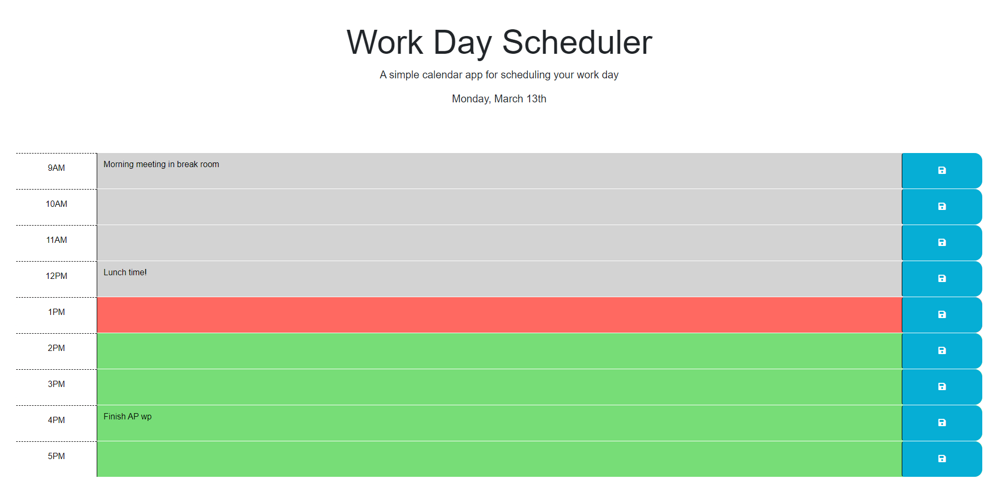

# Challenge 5 - Work Day Scheduler

## Description

This website can be used as a simple schedule tracker for a typical work day. Events and tasks can be added to each line, and upon hitting the save icon, the event will be written to local memory, allowing the user to leave the page and come back to their same task items. This project was built with existing HMTL and CSS, and is meant to demonstrate an understanding of Third-Party APIs and DOM manipulation.

## User Story

**AS AN** employee with a busy schedule

**I WANT** to add important events to a daily planner

**SO THAT** I can manage my time effectively

## Acceptance Criteria

**GIVEN** I am using a daily planner to create a schedule

**WHEN** I open the planner

**THEN** the current day is displayed at the top of the calendar

**WHEN** I scroll down

**THEN** I am presented with time blocks for standard business hours

**WHEN** I view the time blocks for that day

**THEN** each time block is color-coded to indicate whether it is in the past, present, or future

**WHEN** I click into a time block

**THEN** I can enter an event

**WHEN** I click the save button for that time block

**THEN** the text for that event is saved in local storage

**WHEN** I refresh the page

**THEN** the saved events persist

## Challenge Directives

* Satisfies all of the above acceptance criteria plus the following:

  * Uses the Day.js library to work with date and time.

## Demonstration

Website deployed at [eeast.github.io/CH5-WorkDayScheduler/](https://eeast.github.io/CH5-WorkDayScheduler/)

## License

Please refer to the LICENSE in the repo.
